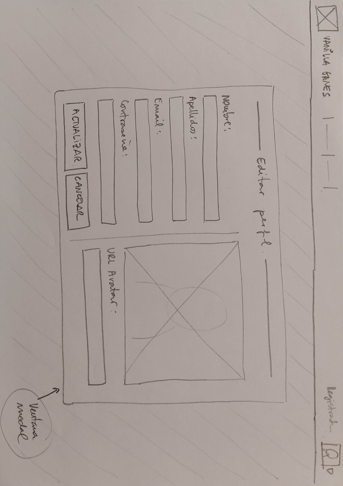
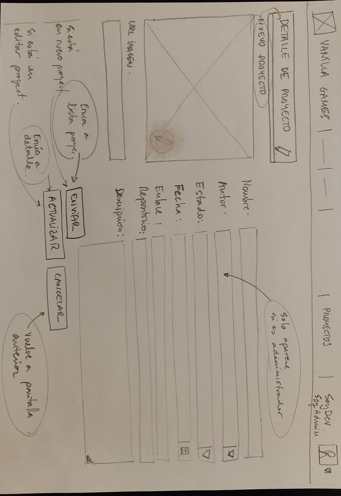

# Documentación
## Escenario del proyecto
**Vanilla Games S.L**. es una empresa de desarrollo de **minijuegos para navegadores web**, creados con vanillaJS, es decir, desarrollados exclusivamente con **Javascript** como lenguaje de programación (sin frameworks)

En esta empresa trabajan 10 desarrolladores y, habitualmente, suelen tener a tres alumnos/as en prácticas, de los cuales, al menos uno, tendrá muchas posibilidades de formar parte del equipo de desarrollo al acabar su etapa de formación.

El método de trabajo que se utiliza en dicha empresa consiste en proponer a cada uno de los miembros del equipo el desarrollo de un minijuego que, al acabar, deberán compartir con el resto de sus compañeros. Estos, a su vez, deben comentar y valorar cada una de las propuestas. Finalmente, en la empresa hay un equipo responsable de seleccionar aquellas propuestas que muestran un mayor potencial, para ser desarrolladas de manera definitiva por todo el equipo de trabajo, con el fin de crear una aplicación para su posterior comercialización.

Hasta la fecha, para el proceso de publicación de proyectos, comentarios y valoración utilizaban algunas herramientas ofimáticas, tipo hoja de cálculo de google. Actualmente pretenden crear una aplicación web tipo intranet para llevar a cabo este propósito.

Como alumno en prácticas, tu trabajo consiste en crear una aplicación web que permitirá a los desarrolladores de Vanilla Games, publicar sus propuestas de minijuegos, de manera que el resto de compañeros podrá hacer comentarios y emitir una valoración de cada proyecto publicado en esta plataforma.

## Requisitos del proyecto y casos de uso general
Los **casos de uso** son una técnica de modelado utilizada en el desarrollo de software para describir las interacciones entre un sistema y sus usuarios. En términos simples, los casos de uso describen cómo los usuarios interactúan con un sistema y qué resultados esperan obtener de él.

### Casos de uso general
Esta aplicación web debe permitir a un usuario **registrarse** (con su nombre, apellidos, email y contraseña) y posteriormente **iniciar** y **cerrar sesión**. Un usuario registrado debe poder ver un **listado de proyectos** publicados por los desarrolladores. También podrá **editar su perfil** y **subir una imagen** de tipo avatar.

Si el usuario registrado tiene el perfil de **‘desarrollador’** , además, debe poder **publicar proyectos** con información del tipo: nombre de proyecto, una descripción, una imagen representativa y dos enlaces, el del proyecto desplegado en un servidor de pruebas y el del repositorio del código correspondiente, el estado del proyecto, etc. También debe poder **eliminar** o **editar sus proyectos.**

Por otro lado, el perfil desarrollador debería poder realizar comentarios de cada uno de los proyectos publicados y añadir una valoración en forma de estrellas.

Finalmente, habrá un administrador que podrá **adminstrar el perfil** de cada uno de los usuarios registrados en la plataforma (editar, borrar, etc) así como modificar el rol de cada uno de estos. También tendrá **control total sobre los comentarios y valoraciones.**


## Fases de desarrollo
Necesitamos organizarnos un poco. Vamos a planificar como vamos a llevar a cabo las diferentes fases para cumplir con nuestros objetivos:

1. **Definición del proyecto y requisitos básicos**: En primer lugar debemos tener muy claro qué se espera de nuestra aplicación, por lo que anotaremos cada funcionalidad teniendo en cuanta los diferentes actores (roles de acceso). Esto es lo hemos hecho en el apartado anterior.

2. **Definición de las versiones**: Una vez conocemos los requisitos del proyecto, dividiremos el trabajo en diferentes versiones, de manera que todas ellas serán operativas, aunque cada una ampliando las funcionalidades.

3. **Planificación del proyecto**: Basandonos en la metodología Agile devidiremos todo el proceso en diferentes historias/tareas (para cada una de las versiones definidas) que: agruparemos, temporizaremos y representaremos mediante diagramas.

4. **Diseño de la interficie**: Basandonos en el diseño centrado en el usuario (DCU):
   - Realizaremos un Benchmarking (para copiarnos de la competencia)
   - Crearemos un modelo de usuarios
   - Diseñaremos los prototipos de bajo nivel(bocetos, wireframes)
   - Diseñaremos el mockup (prototipo de alto nivel) junto a la guía de estilos (usaremos la aplicación Figma)
   - Haremos pruebas de usabilidad y rediseñaremos los prototipos.

5. **Programación del frontend (html/css/js)**: Maquetaremos los prototipos (html/css) y diseñaremos la lógica de validación de cliente

6. **Programación del backend**: Utilizaremos un backend como servicio (SUPABASE) para:
   - Crear las bases de datos
   - Diseñar consultas sql y funciones postgres
   - Programaremos un ORM en javascript para el mapping de la bd.

7. **Integración de frontend y backend en la aplicación**:
   - Programaremos la SPA a partir de los prototipos
   - Programaremos la lógica de acceso a la bd empleando el ORM
   - Programaremos el resto de funcionalidades (sesiones y roles de acceso, etc)

8. **Analisis usabilidad II**: Haremos pruebas de usabilidad (test de usuarios) y solucionaremos los posibles conflictos detectados.

9. **Testing y despliegue en producción**:
   - Diseñaremos un sistema de testing para crear tests unitarios
   - Configuraremos un entorno DevOps para trabajar con Integración continua y despliegue continuo (CI/CD)
   - Desplegaremos en producción cada una de las versiones

## Versiones
Vamos a dividir el desarrollo del proyecto en diferentes versiones a partir de las funcionalidades que podrá realizar:
- VERSIÓN 1.0:
Implementación de la publicación de proyectos
- VERSIÓN 2.0:
Implementación de los comentarios de los proyectos
- VERSIÓN 3.0:
Implementación del sistema de valoración mediante estrellas
- VERSIÓN 4.0:
Implementación del sistema de valoración basado en rúbricas o criterios de valoración.

## Arquitectura y tecnologías
A la hora de decidir la arquitectura a implementar en el desarrollo de nuestro proyecto debemos tener en cuenta una serie de consideraciones previas, como:
- La velocidad de carga inicial
- El SEO
- La experiencia de usuario
- Aspectos técnicos
Vamos a analizar primero algunas de las posibilidades que podemos elegir para la implementación de nuestro proyecto.


## ¿Que arquitectura vamos a utilizar en nuestro proyecto?
En nuestro caso nos **basaremos en CSR**, es decir, renderizamos todo el código html en el navegador. El cliente solo se encargará de responder a las peticiones devolviendo los datos solicitados (en formato json). De esta manera podemos dividir la implementación del proyecto en **FRONTEND y BACKEND**, separando cada funcionalidad y desarrollándola de manera independiente.

## ¿Como diseñaremos nuestro FrontEnd?
### Diseño de la interficie

1. En primer lugar, **para el diseño de la interficie**, crearemos los **bocetos** de nuestra aplicación (con papel y lapiz, como se ha hecho siempre).

2. Más tarde, éstos evolucionarán hacia el **Wireframe** (Diseño de alambres carente de estilo) que finalmente se convertirá en un **Mockup** (diseño con colores y tipografías definitivas). 

3. Para el diseño de este último y para implementación de la **guía de estilos** utilizaremos la herramienta **FIGMA**.

### Maquetación del frontend

1. En primer lugar crearemos los prototipos utilizando **html5**, **css3** y el framework **Bootstrap 5**. Utilizaremos una plantilla Bootswatch que adaptaremos a nuestro diseño mediante **SASS**.

2. Una vez tenemos los prototipos html creados, los integraremos en la SPA e implementaremos la lógica de programación utilizando **VanillaJS** , es decir, con Javascript puro (ES6, sin usar frameworks)

## ¿Como implementaremos las funcionalidades del BackEnd?

### Usaremos SUPABASE como servicio de Backend

En el lado del backend utilizaremos Supabase como servicio backend.

Este servicio nos permite almacenar la información en **bases de datos relacionales** en un entorno basado en **postgreSQL**.

También nos ofrece, entre otros:

- Un sistema de **autenticación** basado en proveedores como google, github, etc.
- Un sistema de control de accesos según roles a través de las **políticas de permisos.**
- Un **storage** de almacenamiento de archivos (para las imágenes) en los buckets que nos permite configurar.
- Una **API en javascript** para las peticiones más frecuentes que atacan a las tablas de la bd **(CRUD)** así como un sistema de **funciones personalizadas** (con sus correspondiente api en js) para hacer consultas específicas (por ejemplo, consultas multitabla)

## Nuestro entorno de desarrollo: VSCODE

En el entorno de desarrollo tendremos a **VSCode** trabajando sobre **Nodejs** y su gestor de paquetes npm.

- Configuraremos el IDE con los **plugins** necesarios para facilitar un buen flujo de trabajo.
- Formatearemos el código siguiendo el estándar **'Standard'** mediante herramientas de verificación de código como **'Eslint'.**
- Para el control de versiones trabajaremos con un repositorio Git que sincronizaremos con una cuenta de **Github.**
- En el proceso de desarrollo emplearemos el flujo de trabajo **'Flujo de rama de funcionalidad'**. Es decir, crearemos ramas específicas para cada funcionalidad que integraremos en la rama principal una vez testadas las funcionalidades. Así, nuestro repositorio reflejará todo el proceso de trabajo, las diferentes versiones, etc.

## Y para el despliegue de nuestras aplicaciones

Desplegaremos el proyecto en **github pages** (en la fase de pruebas) y utilizaremos un servicio como por ejemplo **RailWay, Netlify**, etc para el despliegue en producción.

## Diagrama de casos de uso para la versión 1.0


## Casos de uso específicos y diagramas de flujo.
En el primer apartado 'Requisitos y diagrama de casos de uso' para esta versión 1.0, hemos definido de manera general los **casos de uso** que se contemplan para cada actor y los hemos reflejado en un **diagrama de casos de uso.**

Es el momento de ser más concretos y detenernos a reflexionar en cada uno de los procesos que se realizarán para cada tarea, incluyendo los posibles errores cometidos por el usuario o el propio sistema.

## Casos de uso específicos
### 1. Registrar usuario

**Actores:** Usuario no registrado.

**Precondiciones:** El usuario no ha iniciado sesión.

**Flujo básico:**

1. El usuario navega a la página de registro.
2. El usuario introduce su nombre, apellidos, email y contraseña.
3. El sistema valida que los campos estén completos y que el email no esté registrado previamente.
4. El sistema crea un nuevo usuario con los datos proporcionados.
5. El sistema muestra un mensaje de confirmación y redirige al usuario a la página de inicio.

**Flujos alternativos:**

- 3a. El sistema detecta que el email ya está registrado: muestra un mensaje de error y no crea la cuenta.

### 2. Recuperar contraseña

**Actores:** Usuario registrado.

**Precondiciones:** El usuario no ha iniciado sesión.

**Flujo básico:**

1. El usuario navega a la página de registro.
2. El usuario selecciona la opción 'Recuperar contraseña'
3. El sistema valida que el campo 'email' esté completo y que el email esté registrado previamente.
4. El sistema muestra un mensaje de confirmación de envío del mail para la recuperación de contraseña y redirige al usuario a la página de inicio.

**Flujos alternativos:**

- 3a. El sistema detecta que el email no está registrado: muestra un mensaje de error y no envía el mail.

### 3. Iniciar sesión

**Actores:** Usuario registrado.

**Precondiciones:** El usuario no ha iniciado sesión.

**Flujo básico:**

1. El usuario navega a la página de inicio de sesión.
2. El usuario introduce su email y contraseña.
3. El sistema valida las credenciales y crea una sesión para el usuario.
4. El sistema redirige al usuario a la página principal de la aplicación.

**Flujos alternativos:**

- 3a. Las credenciales son incorrectas: el sistema muestra un mensaje de error y no crea la sesión.

### 4. Cerrar sesión

**Actores:** Usuario registrado.

**Precondiciones:** El usuario ha iniciado sesión.

**Flujo básico:**

1. El usuario hace clic en el botón de "cerrar sesión".
2. El sistema cierra la sesión del usuario.
3. El sistema redirige al usuario a la página de inicio.

### 5. Ver/Editar perfil

**Actores:** Usuario registrado.

**Precondiciones:** El usuario ha iniciado sesión.

**Flujo básico:**

1. El usuario navega a la página de edición de perfil.
2. El usuario edita su nombre, apellidos y contraseña.
3. El sistema valida los campos y actualiza el perfil del usuario.
4. El sistema muestra un mensaje de confirmación.

**Flujos alternativos:**

- 3a. El usuario intenta cambiar su email: el sistema valida que el email no esté registrado previamente.

### 6. Ver proyectos

**Actores:** Usuario registrado.

**Precondiciones:** El usuario ha iniciado sesión.

**Flujo básico:**

1. El usuario navega a la página de proyectos.
2. El sistema muestra una lista de proyectos publicados por desarrolladores.
3. El usuario puede hacer clic en un proyecto para ver más detalles.
4. El usuario puede mostrar/filtrar los proyectos a partir de un buscador.

### 6. Publicar proyecto

**Actores:** Usuario registrado con perfil de desarrollador.

**Precondiciones:** El usuario ha iniciado sesión y su perfil es de desarrollador.

**Flujo básico:**

1. El usuario navega a la página de publicación de proyecto.
2. El usuario introduce el nombre, descripción, imagen representativa, enlaces de servidor y repositorio, estado y otra información relevante del proyecto.
3. El sistema valida los campos y crea un nuevo proyecto.
4. El sistema muestra un mensaje de confirmación y redirige al usuario a la página de proyectos.

**Flujos alternativos:**

- 2a. El desarrollador decide no publicar el proyecto y selecciona la opción de cancelar.
  1. El sistema descarta la información ingresada en el formulario.
  2. El sistema muestra un mensaje de confirmación al desarrollador.

### 7. Editar proyecto

**Actor principal:** Desarrollador

**Objetivo:** Editar la información de un proyecto previamente creado.

**Precondiciones:** El usuario debe haber iniciado sesión como desarrollador y tener al menos un proyecto previamente creado.

**Flujo principal:**

1. El usuario selecciona la opción de "Editar proyecto".
2. El sistema muestra la lista de proyectos previamente creados por el usuario.
3. El usuario selecciona el proyecto que desea editar.
4. El sistema muestra el formulario de edición del proyecto con la información actual del mismo.
5. El usuario realiza los cambios necesarios en la información del proyecto y guarda los cambios.
6. El sistema valida la información ingresada por el usuario y actualiza la información del proyecto en la base de datos.
7. El sistema muestra una confirmación de que la información del proyecto ha sido actualizada correctamente.

### 8. Eliminar proyecto

**Actor principal:** Desarrollador

**Objetivo:** Eliminar un proyecto previamente creado.

**Precondiciones:** El usuario debe haber iniciado sesión como desarrollador y tener al menos un proyecto previamente creado.

**Flujo principal:**

1. El usuario selecciona la opción de "Eliminar proyecto" del proyecto que desea eliminar.
2. El sistema muestra una confirmación de que el usuario está seguro de eliminar el proyecto seleccionado.
3. El usuario confirma que desea eliminar el proyecto.
4. El sistema elimina el proyecto de la base de datos y muestra una confirmación de que el proyecto ha sido eliminado correctamente.
5. El sistema actualiza la información de proyectos.

### 9. Ver/Editar usuario

**Actor principal:** Usuario administrador

**Objetivo:** Editar la información de los usuarios registrados.

**Precondiciones:** El usuario debe haber iniciado sesión en la aplicación y tener rol administrador.

**Flujo principal:**

1. El usuario selecciona la opción de "Ver usuarios".
2. El sistema muestra una tabla con 'inputs' con los datos de los usuarios.
3. El administrador realiza los cambios necesarios en la información de los usuarios (incluido el rol y el estado) y guarda los cambios.
4. El sistema valida la información ingresada por el usuario y actualiza la información del usuario en la base de datos.
5. El sistema muestra una confirmación de que la información del perfil ha sido actualizada correctamente.

### 10. Eliminar usuario

**Actor principal:** Usuario administrador

**Objetivo:** Eliminar usuario del sistema.

**Precondiciones:** El usuario debe haber iniciado sesión en la aplicación y debe tener rol administrador.

**Flujo principal:**

1. El usuario selecciona la opción de "Ver usuarios".
2. El sistema muestra una tabla con 'inputs' con los datos de los usuarios.
3. El administrador hace clic sobre el icono de eliminar usuario de la fila correspondiente.
4. El sistema informa de que se eliminarán todos sus registros.
5. El sistema muestra una confirmación de que la información de que el usuario ha sido borrado correctamente.

## Errores

Vamos a repasar los diferentes casos de uso analizando el flujo principal y añadiendo los flujos alternativos para contemplar los posibles errores del sistema. Puedes considerar los siguientes mensajes:

1. **Error de conexión:** El servidor no puede establecer una conexión con la base de datos, lo que impide que se puedan realizar operaciones en la plataforma. **El sistema debería mostrar un mensaje de error indicando que no se pudo conectar con la base de datos** y ofrecer la posibilidad de volver a intentarlo o contactar con el soporte técnico.

2. **Error de validación:** Cuando el sistema recibe información del usuario, debe validarla para asegurarse de que cumple con los requisitos de formato y contenido necesarios. Si la información no es válida, **el sistema debería mostrar un mensaje de error indicando el problema específico**, como "El campo de correo electrónico debe ser una dirección de correo válida".

3. **Error de autenticación:** Si un usuario intenta acceder a una página o realizar una acción que requiere autenticación, pero no ha iniciado sesión o sus credenciales son incorrectas, **el sistema debería mostrar un mensaje de error indicando que la acción no está autorizada** y ofrecer la posibilidad de iniciar sesión o recuperar la contraseña.

4. **Error de autorización:** Si un usuario intenta realizar una acción que no está autorizada para realizar debido a su rol, **el sistema debería mostrar un mensaje de error indicando que la acción no está autorizada** y ofrecer la posibilidad de volver a la página anterior.

5. **Error de servidor:** En caso de que se produzca un error interno en el servidor, como una excepción no controlada, **el sistema debería mostrar un mensaje de error genérico indicando que se produjo un error** y ofrecer la posibilidad de volver a intentarlo o contactar con el soporte técnico.

## Diseño de la interfaz. Bocetos
Una vez tenemos claro las funcionalidades que debe realizar nuestra aplicación, comenzamos con el diseño de la interfaz.

Este proceso incluye diseñar los bocetos, los wireframes y los mockups ,para acabar creando los prototipos con html.

Sin duda, el primer paso, debe ser dibujar los bocetos, así que, busca un lápiz, una goma de borrar y un puñado de papel, ¡y manos a la obra!

### Diseño de bocetos
#### Home y menús usuarios


Hemos didivido la interficie en 3 zonas, el encabezado (header), el cuerpo principal (main) y el pie de página (footer).

- En el header vamos a alojar una barra superior fija con: el logo y nombre de la web (que hará las veces de link a la página principal), un menú central genérico (para acceder a páginas públicas), un menú central específico (que será diferente en función del rol de usuario logueado), y un icono (avatar) que permitirá ver la imagen del usuario logueado y que hará de botón para desplegar otro menú, el menú de usuario (que tendrá diferentes items dependiendo de si la sesió está abierta o no y del tipo de rol que tenga el usuario logueado).

- El cuerpo (main) albergará el contenido de las páginas. Será la sección que vaya cambiando dependiendo de la página que carguemos. En la página home simplemente aparece una imagen de fondo y el nombre de la web.

- El header será meramente informativo.

#### Regitro de un usuario


#### Iniciar sesión


#### Editar mi perfil

Editar perfil será una ventana modal, es decir, se mostrará la ventana y el fondo se volverá oscuro.

Esta ventana de edición permitirá, además de modificar los datos del usuario, **añadir una imagen de avatar.** Por el momento, en esta primera versión, podremos añadir el link de una imagen que esté alojada en un servidor. En la siguiente versión (versión 1.1) actualizaremos esta ventana para que puedan **subirse archivos** (imágenes) al servidor.

#### Listado de todos los proyectos

En esta página podemos ver, en la pestaña izquierda, todos los proyectos en forma de tabla. La pestaña derecha mostrará solo los proyectos que ha subido el usuario que ha iniciado la sesión.

Al hacer clic en cualquier parte de la fila se accede al detalle del proyecto.

También tenemos un buscador que permite buscar proyectos por palabras clave en el nombre o descripción.

Las celdas de encabezado de las tablas incluyen un icono (flecha hacia arriba o hacia abajo) que permitirá ordenar la tabla por la columna en concreto.

#### Listado de mis proyectos


En esta pestaña podemos ver los trabajos pertenecientes al usuario logueado. En cada fila aparece, además, un icono para editar y borrar el proyecto correspondiente. Por otro lado tenemos la opción de subir un nuevo proyecto.

_Habría que valorar si es mejor crear un único buscador para el nombre y descripción del proyecto o dos barras de busqueda, una para cada sección, tal y como se muestra en el boceto anterior._

#### Detalle de un proyecto


Si el usuario que está viendo la información de un proyecto en concreto es el autor de dicho proyecto, aparecerá un icono para la edición del mismo.


#### Nuevo proyecto / Editar un proyecto


Esta vista sirve tanto para crear un nuevo proyecto como para editarlo.

Si el proyecto es nuevo, el botón mostrará el texto _ENVIAR_, pero si estamos editándolo aparecerá el texto _ACTUALIZAR_. Al crear o actualizar el proyecto, la web nos reenvía a la vista 'Detalle de proyecto'.

#### Panel administración de proyectos


Si tienes el rol 'administrador' aparecerá el item 'Panel administración' en el menú superior específico. Este item nos permite cargar la vista 'Panel administración de proyectos'. Desde esta vista también podemos acceder al 'Panel administración de usuarios'.

Esta vista permite editar o borrar cualquier proyecto haciendo click en los iconos correspondientes. La opción editar nos llevará a la vista 'Editar proyecto'

#### Panel administración de usuarios


Esta vista permite **editar los datos de los usuarios.** Por supuesto es solo accesible para los administradores.

En esta vista, el método para editar la información es diferentes. Aquí los datos **aparecen sobre 'inputs'**, de manera que al hacer clic sobre ellos, aparecerá el cursor de edición. Se pueden modificar todos los datos (en especial el _'estado'_ y el _'rol'_ del usuario) excepto el email.


## Hist3b - Test de usuarios inicial

### Primer Test de Usabilidad

Tal y como hemos comentado en el apartado 'Diseño centrado en el usuario', una de las premisas de esta metodología consiste en realizar evaluaciones constantes para detectar los posibles problemas de usabilidad cuanto antes mejor. Por lo que una buena idea es realizar un primer test de usabilidad.

Por el momento os adelanto que la técnica más utilizada par evaluar la usabilidad son los 'tests de usuario'.

Estos consisten en crear una bateria de acciones que el usuario debe realizar, para detectar si existe algún problema en la interación con la aplicación. A continuación vamos pidiendo a un usuario focal (una persona que esté dentro del target de usuarios a quien va dirigida la app) que realice cada tarea, mostrandole los bocetos que aparecerán en cada interacción. Por ejemplo, si hace clic sobre el item de menú 'login' le mostraremos el boceto de la página 'login'.

Para este primer test hemos preparado las siguientes acciones:

Suponiendo que eres un usuario no registrado:

1. Accede a la información general 'A cerca de' de esta web.
2. Regístrate.
3. Logueate.
4. Modifica tu perfil añadiendo una imagen de avatar.
5. Busca un proyecto llamado 'Tetris'.
6. Accede al detalle de este proyecto.
7. Cierra sesión.

Suponiendo que eres un usuario con rol 'Desarrollador':

1. Crea un proyecto nuevo.
2. Accede a la lista de tus proyectos.
3. Muestra el detalle de tu nuevo proyecto.
4. Edita tu proyecto cambiando la descripción.
5. Borra tu proyecto.

Suponiendo que eres un usuario con rol 'Administrador':

1. Muestra la lista de proyectos.
2. Borra un proyecto.
3. Modifica el nombre de un proyecto.
4. Muestra la listra de todos los usuarios registrados.
5. Canvia el rol de uno de ellos.
6. Modifica la imagen de su avatar.

> **Nota**
> Las acciones del test de usuarios han sido realizadas por una persona de 20 años, con estudios universitarios y acostumbrado a navegar por la red y usar herramientas ofimáticas.

### Conclusiones y modificaciones

De este primer test de usuario se desprenden las siguientes conclusiones:

- La vista de proyectos en forma de tabla no es muy atractiva.
- El usuario ha tenido dificultades a la hora de intentar modificar la imagen avatar de un usuario.

Para mejorar estos pequeños problemas de usabilidad vamos a tomar las siguientes acciones:

1. En la vista de proyectos vamos crear un par de botones para poder alternar entre ver los proyectos en forma de tabla o en forma de tarjetas.
2. En la vista de administración de usuarios, añadir un pequeño icono (un lápiz) sobre la imagen del avatar del usuario para que se intuya que, al hacer clic sobre la imagen, se accede a la ventana de modificación de perfil.

Estos serían los bocetos actualizados:

#### Vista de proyectos


#### Vista del Panel de administraición de usuarios.


Ahora que tenemos los bocetos creados y testeados, es el momento de pasar al siguiente nivel: El diseño de los wireframes.


## Hist4 - Wireframe, mockup y guía de estilos

En el apartado anterior hemos diseñado y testeado los bocetos para la versión 1.0 de nuestro proyecto.

El siguiente paso, si nos basamos en el **DCU** (Diseño centrado en el usuario), sería diseñar los **wireframes** y, una vez tenemos los wireframes, los **mockups** junto a la **guía de estilos**.

### Recuerda que...

- **Boceto**: Un dibujo rápido que representa ideas.
- **Wireframe**: Una representación estructural y esquemática.
- **Mockup**: Una versión visualmente detallada del diseño.
- **Guía de estilos**: Establece las pautas visuales y de diseño para un proyecto.

Un proyecto de mayor envergadura requeriría de un equipo de trabajo con más de un perfil. La tarea de diseñar la interfaz corresponde, por un lado, al arquitecto de la información y por otro, a un diseñador gráfico.

### ¿Y nosotros, necesitamos wireframe? ¿y mockup? ¿y guía de estilos?

En nuestro caso, como el proyecto es muy básico, no nos vamos a centrar en aquellas tareas que corresponderían a un arquitecto de la información ni a un diseñador gráfico.

El mapa web de nuestra aplicación se limita a dar acceso a los proyectos y la administración de los usuarios. Sería tan sencillo como este:

En cuanto al diseño gráfico, aunque es una misión emocionante, nos vamos a limitar a trabajar con un tema de **Bootstrap** utilizando **Bootswatch**, respetando, a priori, su paleta de colores y modificando solo en algunos casos algunos detalles como la fuente para los títulos.

### Nota

Puedes ver el aspecto del tema que vamos a utilizar en el siguiente enlace: [Bootswatch Cosmo](https://bootswatch.com/cosmo/).

### ¿Qué es Bootswatch?

Bootswatch es una biblioteca de temas (themes) para Bootstrap, un popular framework de desarrollo web. Al utilizar Bootswatch, puedes cambiar fácilmente la apariencia de tu proyecto de Bootstrap simplemente importando los archivos CSS correspondientes al tema deseado. Esto te permite ahorrar tiempo y esfuerzo al no tener que crear los estilos desde cero.


## Hist5 - Entorno de desarrollo

### Comenzamos el SPRINT 2 - PROTOTIPOS

Comenzamos el sprint 2 que incluye tres historias: La configuración del entorno de desarrollo, la maquetación de los bocetos y la implementación de la validación de los formularios.


> "Dame seis horas para cortar un árbol y pasaré las primeras cuatro afilando el hacha." – Abraham Lincoln

Si queremos ser eficientes en la creación de aplicaciones web, lo mejor es empezar por configurar bien nuestro entorno de desarrollo. Para ello vamos a instalar/configurar las siguientes herramientas:

- Un buen software para escribir nuestro código. En nuestro caso usaremmos el programa VSCode de Microsoft.
- Instalación del software para el control de versiónes. Nosotros instalaremos GIT.
- Una aplicación web para sincronizar nuestro repositorio en la nube. En nuestro caso será GitHub.

#### 1. VSCode

Sin duda, en le momento de escribir esta documentación, el rey de los IDs es, sin duda, Visual Studio Code (VSCode).

> VSCode es un programa muy útil para escribir código. Es como una navaja suiza para los desarrolladores. Te permite editar y organizar tus archivos de código de manera fácil y rápida. Además, tiene un montón de extensiones y herramientas fantásticas que te facilitan la vida, como autocompletado, depuración y control de versiones. En resumen, es como el mejor amigo de un programador, siempre dispuesto a ayudarte a escribir código de manera eficiente.

Os hago un resumen de algunas aspectos que debes tener en cuenta a la hora de instalar y configurar VSCode, y te pondré información ampliada ya que es un tema muy trillado en internet:

##### 1.1. Descarga e instala VSCode

[Puedes encontrar la versión oficial de vscode aquí](url_de_descarga)

##### 1.2. Elige el tema que más te guste.

Puedes tunear tu VSCode instalando diferentes temas. Para ello:

1. Desde el buscador de extensiones (ctrl + mayus + X) escribe el nombre del tema que quieres instalar.
2. Haz clic en instalar extensión.
3. Desde el icono de configuración de vscode (la tuerquecita de abajo a la izquierda) selecciona 'Temas > Tema de color'
4. Selecciona el tema que has instalado y... ¡ya lo tienes!


##### 1.3. Instala un tema de iconos, por ejemplo VSCode Icons o Material Icon

Para instalar los iconos el proceso es el mismo:

1. Desde el buscador de extensiones escribe el nombre del tema de iconos
2. En configuración, selecciona 'Tema > Tema de icono de archivo' y busca el tema instalado.
3. Ahora verás que en la columna de la izquierda, cada archivo tiene un icono diferente en función de su extensión: html, css, etc.

##### 1.4. Extensiones

Con las extensiones puedes aumentar la potencia y mejorar tu flujo de trabajo.

##### Prettier

Una de las extensiones que te recomiendo sí o sí es 'Prettier'. Esta extensión se va a encargar de formatear tu código HTML y CSS port tí, respetando las identaciones. El proceso para instalar esta extensión es muy simple, solo tienes que buscar la extensión en el buscador y darle a instalar.


##### Live Server

Otra extensión imprescindible para nosotros es Live Server. Mediante esta extensión podremos tener un servidor virtual que mostrará el resultado de nuestro trabajo en un navegador, con la ventaja de que la vista se irá actualizando conforme vamos modificando el código.

Existen infinidad de extensiones para VSCode Aquí puedes ver un ejemplo de mi entorno. Utilizo el tema Night Owl y los iconos de VSCode Icons. Fijate que el código html está formateado con Prettier

De momento, con esto es suficiente para comenzar a trabajar en el desarrollo de los prototipos html y css. Más adelante acabaremos de configurar nuestro entorno para trabajar con NodeJS y otras herramientas que nos ayudarán a programar de forma más eficiente.

#### 2. Control de versiones - Git

Para el control de versiones vamos a instalar y configurar Git. Aunque seguro que a estas alturas ya sabes qué es Git, pero deja que te refresque algunas ideas importantes:

> ✔ Git es como un superpoderoso control de versiones para tu código. Imagina que estás escribiendo un ensayo importante y cada vez que haces cambios guardas una nueva versión en diferentes archivos, como "ensayo_v1", "ensayo_v2" y así sucesivamente. Git hace algo similar pero para tu código.

> ✔ Con Git, puedes guardar diferentes versiones de tu proyecto a medida que avanzas. Esto significa que si cometes un error o quieres volver a una versión anterior, ¡es pan comido! Git te permite viajar en el tiempo y regresar a cualquier punto en la historia de tu proyecto.

> ✔ Pero eso no es todo. Git también es excelente para trabajar en equipo. Puedes colaborar con otros programadores sin pisar los pies de nadie. Cada persona puede trabajar en su propia versión del proyecto y luego combinar los cambios de todos de manera ordenada.

> ✔ Además, Git hace que compartir tu código sea súper fácil. Puedes subir tu proyecto a un repositorio en línea (como GitHub o GitLab) y otras personas pueden descargarlo y contribuir. Incluso puedes colaborar con desarrolladores de todo el mundo en proyectos de código abierto.

```
$ git config --global user.name "John Doe"
$ git config --global user.email johndoe@example.com  
```

Sólo necesitas hacer esto una vez si especificas la opción --global, ya que Git siempre usará esta información para todo lo que hagas en ese sistema


#### 3. Repositorio en linea - Github

Ahora que tenemos Git instalado en nuestro ordenador, vamos crearnos una cuenta en Github para poder sincronizar todo nuestro trabajo en la nube.

##### ¿Qué es y para que sirve Github?

✔️ GitHub es una especie de red social para programadores. Es un lugar en línea donde los desarrolladores pueden compartir y trabajar en proyectos de software.

✔️ Funciona como un repositorio donde se guarda el código de diferentes versiones de un proyecto. Permite la colaboración entre programadores, quienes pueden ver y sugerir cambios en el código.

✔️ Es una herramienta muy popular y útil en la comunidad de desarrollo de software.

1. En primer lugar vamos a acceder github.com
2. Crea una cuenta e inicia sesión.
3. Ahora vamos a crear un proyecto de prueba con vscode, craremos un repositorio y lo sincronizaremos con github.

